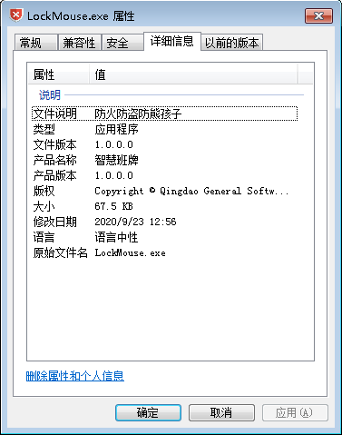
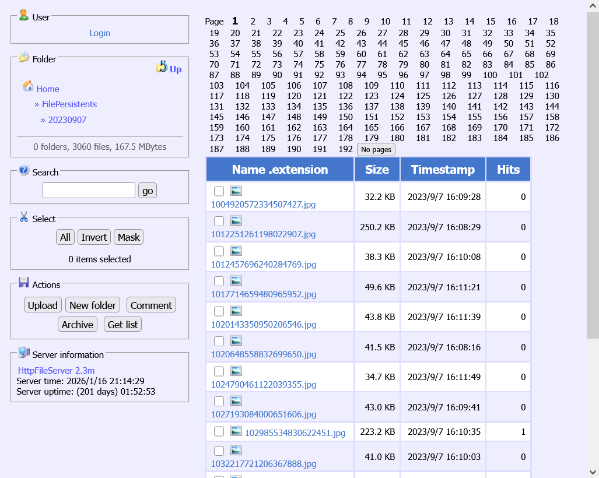
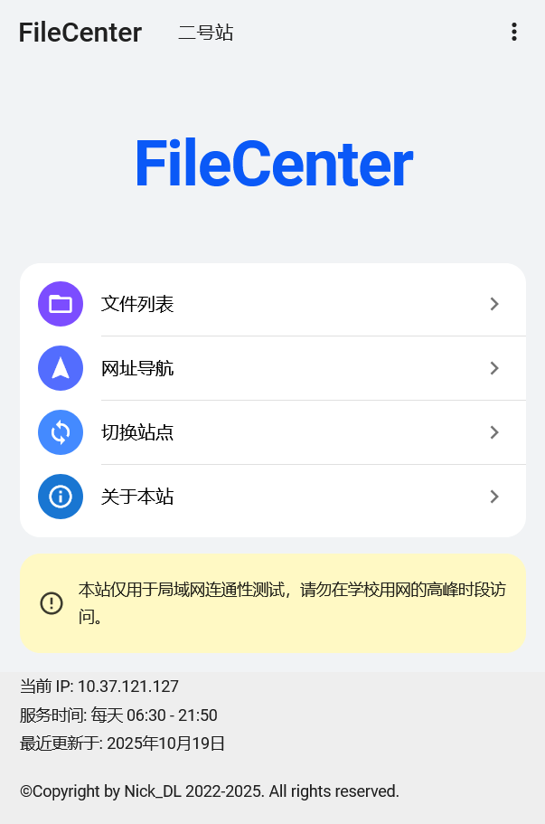

# 5. 电子班牌（请假系统）

电子班牌是同学们除希沃外能接触到的最多的设备。从其数量规模、软硬件功能来看，其可玩性非常高。

## 请假系统

或许更准确的名字是"考勤系统"。这套系统由"青岛通软网络科技有限公司"搭建并维护，硬件上为各教室装配了"电子班牌"，为各寝室大厅装配了一台寝室考勤机，为各校门装配了校门考勤机（其中包括绵中山庄的一台常年在WinRE界面的未配置功能的），在学生刷卡时读卡器识别NFC卡号后，主程序记录对应学生的相关信息。软件上，三种硬件设备运行的主程序架构一致但组件上略有差异，此外有微信服务渠道（供家长批假）、APP（供教师、宿管使用）及后端服务器（10.37.2.23:8087）及其对应外网IP地址可访问、登录。

## 主程序

电子班牌及考勤机的主程序用C#语言编写，请假页面是网页。主程序中主体一致，三种机器的程序差别主要在Addons目录下的插件中。该程序极为臃肿，代码据说相当复杂，程序目录下的日志也经常从2018年刚装上那会积攒到现在。

## 电子班牌运行机制

正常情况下，电子班牌在06:30（高三）/07:15（高一、高二）开机，开机后启动LockMouse.exe，关任务栏，约一分钟后主程序启动完毕。一直到晚上21:50执行任务计划程序中的命令关机，随后电源处下指令关机。周末一般会处于关机状态。一些经修改的电子班牌会晚于一般时间关机。

正常情况下电子班牌IPv4地址设置的是手动IP 10.37.120.x，该IP与机器一一对应。山下的电子班牌在设置手动IP时可访问校园网网站，通过上网验证访问互联网。山上的则不能，需修改为自动IP，会分配到10.37.121（一般）/120.x，处于自动IP下，电子班牌无法接收海报及考场信息，但可请假。无论处于何种情况，电子班牌间相互都能以各自IP通信，校园网内其余设备仅能与自动IP的电子班牌通信。对手动IP电子班牌的AP隔离据说是从2024年初开始的。

## 基础玩法

通过在AppBar上左右滑动五个来回 (正确的操作似乎是上滑一次即可)，可打开配置面板。在数字键盘上输入1-8任意数字可切换主题。（注：输入8位数`[CONDENSED]`可打开调试菜单）


## 神秘玩法

::: danger
⚠️ 李波（化学）马上到你教室门口！
:::


### 解除 LockMouse.exe 框格

LockMouse.exe的功能显而易见，在程序属性里有"防火防盗防熊孩子"的描述。它运行时在屏幕上显示透明全屏窗口，仅操作电子班牌程序的触控/鼠标操作可被穿透。其功能对于Windows 8+的UWP界面无效。


**关闭 LockMouse.exe**：撬锁后接上键盘；或登录远程桌面；或用特殊手法，在Tablet PC输入面板快捷浮窗存在的情况下，在其周围长按数次打开Tablet PC软键盘；按Alt+Tab切换到1个无名窗口上，按Alt+F4关闭该窗口。

**禁止 LockMouse.exe 开机启动**：使用命令：

```bash
taskkill /im LockMouse.exe /f
taskkill /im explorer.exe /f
explorer
```

可添加至任务计划程序，或写到.cmd文件里，放到开始菜单"启动"/"startup"文件夹下（没有需新建）。

### 撬锁

使用带一侧凸起的纸棍或半片指甲刀可打开机身右侧接口/开关面板的盖子。随后可接USB设备。

### 远程桌面

连接远程桌面需在电子班牌间操作，除自动IP的外。密码一般为`[CONDENSED]`或`[CONDENSED]`，账户为`Administrator`。

电子班牌配置的手动IP顺序大致为：远志楼→铭志楼→远翔楼→通慧楼→六艺楼→宿舍→校门。各活动教室（按几年前时教室的排布）、办公室、阶梯教室、机房等的IP在约150至240间穿插。

信息中心有IP表。

### 图片 CDN

打开 `10.37.2.21:8080` 可以看到2018年以来电子班牌系统使用的所有图片素材，如头像、班级展示墙图片、宣传海报图片等。未登录不能修改，只能上传/下载。


### 圣遗物

- IPConfig：学长装在通慧楼一部分电子班牌上的小插件，会在左上角显示IP地址后两位。

- Addons中的申必缓存：在一些电子班牌的主程序Addons目录下可见名为"Cirno.ChinaGS.Injection.Temp"的隐藏文件夹。参见 [超高阶玩法](#超高阶玩法)

- FileCenter：用电子班牌搭建的静态文件站，内含常用网站导航。


## 超高阶玩法

绵中曾有一位学长对电子班牌主程序的代码注入、机制，以及后端服务器等做了深入研究，有兴趣的可以打开他的主页。

[网站](https://konata233.github.io/)

[GitHub主页](https://github.com/myhsp)

::: info
注意：截至发稿，本站还未与该大佬取得联系（缺联系方式）。看到大佬的研究成果被时间湮没，而编者没有能力进行相关研究，感到十分遗憾。

故在此记录，希望有识之士能加以研究，或参与完善。
:::